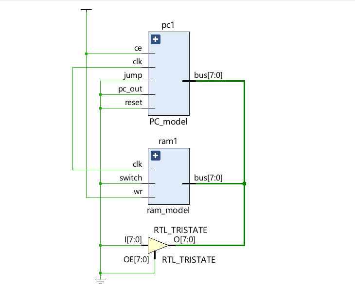
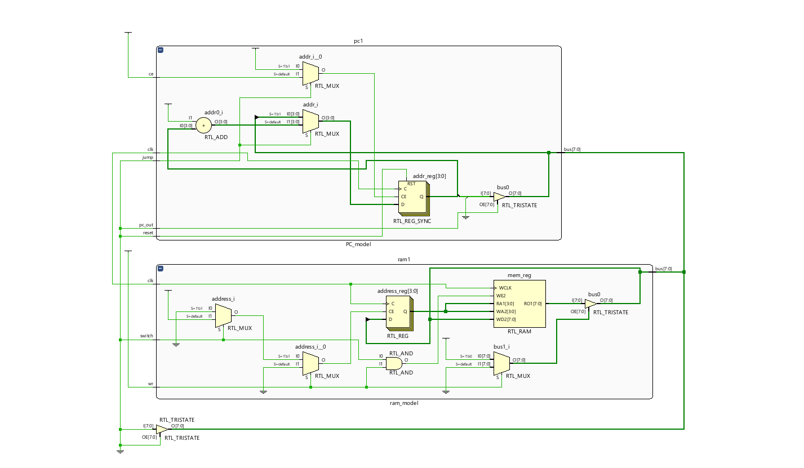
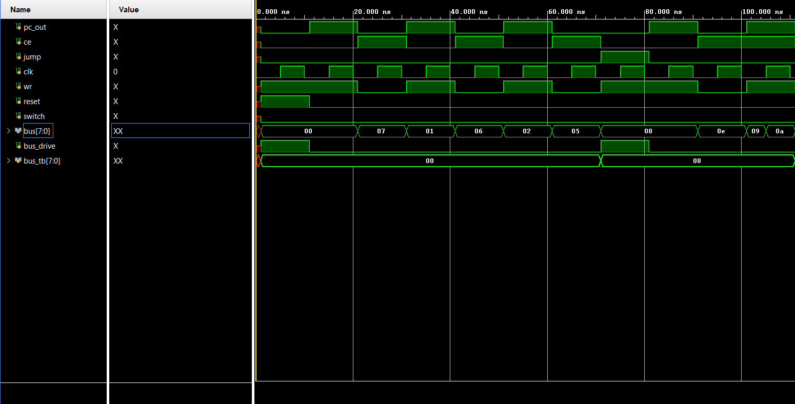

# Program Counter
Made a Program Counter which increments the address, passes it to the bus and the RAM reads it for passing the stored value , designed and implemented in AMD Xilinx Vivado.

## Modules
|**Module Name**|**Function**|
| :--- | :--- |
|Program-Counter|`pc_model` is the main element of this project, it increments the 4-bit address by 1 bit each time the count_enable function is on.
It gives instruction to the RAM as to which memory element is currently needed.|
|RAM-Model|`ram_model` is a 16x8-bit synchronous memory storage RAM which enables us to store 16 elements of 1 byte (8bits) each.|

## Operations Allowed
|**Operations**|**Symbol**|**Function**|
| :--- | :--- | :--- |
|PC 's output|`pc_out`| Its function is to pass the address value stored in the pc to the bus |
|Count Enable|`ce`| Enables the count value of the Program counter so that it increments the address to the next program needed |
|Jump|`jump`| Jumps the PC address' value to the desired address, the next operation on the increment of the program will now start from here |

## Schematic :
### Full Overview:

### Full Schematic:

## Simulations :

